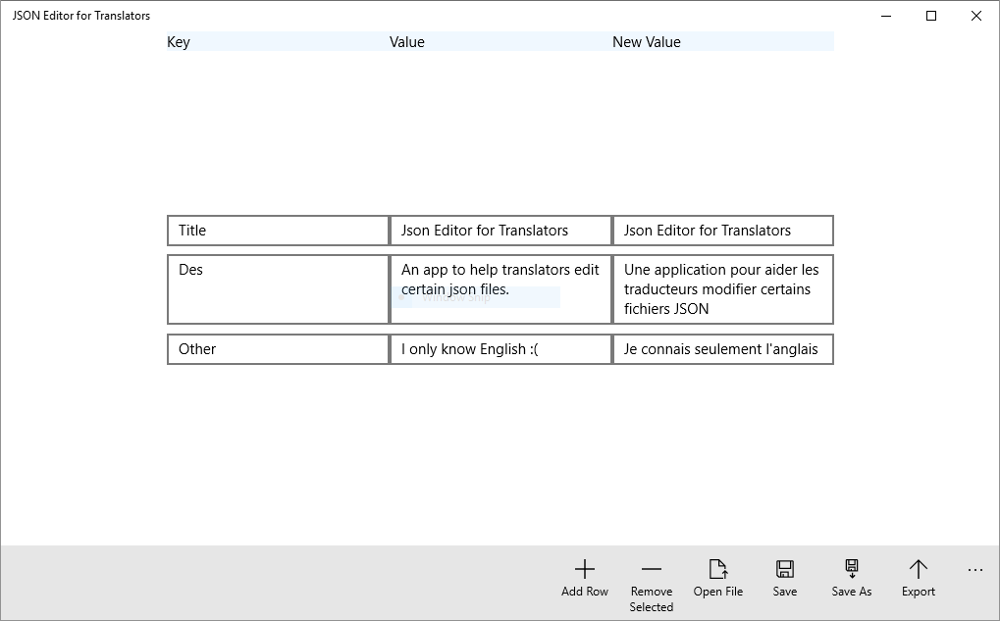
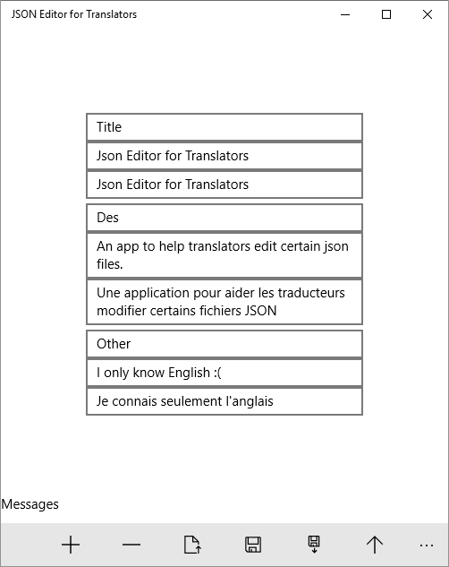

# json-editor-for-translators

Created by Alexander Poganatz

This is a Universal Windows App to assist translators in editing json files.

Choosing a row to remove is a bit tricky at the moment. 
I'll eventually try to fix that and other GUI issues.

Sample exported file:

{"IsExportedFile":true,
"Title":"Json Editor for Translators",
"Des":"Une application pour aider les traducteurs modifier certains fichiers JSON",
"Other":"Je connais seulement l'anglais"}

